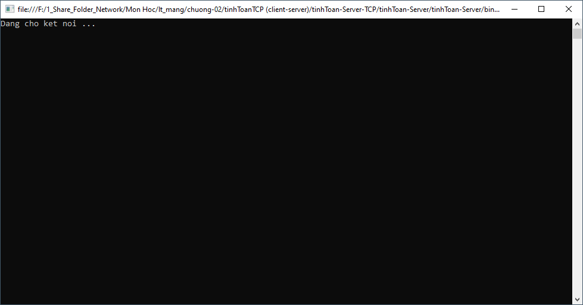
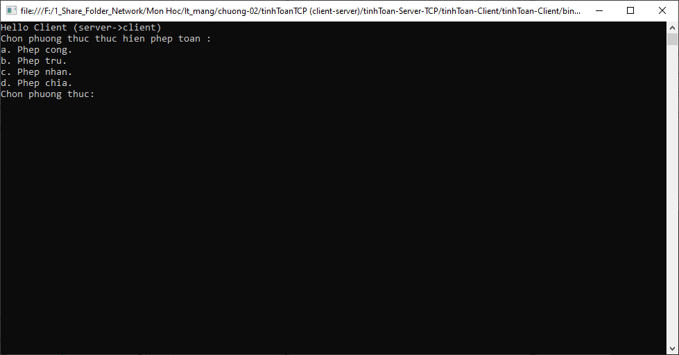
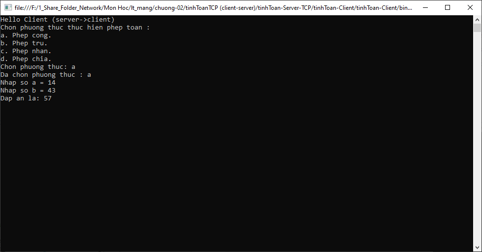

# Bài tập : XÂY DỰNG 1 CLIENT-SERVER TÍNH TOÁN ĐƠN GIẢN

# Nội dung :

Thực hiện các chức năng như :

- Kết nối giữa Server và client
    - có thể khởi động bằng client hoặc server (client sẽ chờ server khởi động).
- Bên Server sẽ gửi các yêu cầu thực hiện phép toán.
- Bên Client sẽ lựa chọn phép toán đồng thời nhập số a và b.
- Kết quả sẽ được tính toán bên phía server và gửi trả về cho bên client.

# Một vài hình ảnh :



Bên Server mở kết nối và trong trạng thái chờ.



Bên Server sẽ gửi các yêu cầu thực hiện phép toán cho bên Client.



Bên Client sẽ thực hiện chọn phép toán cần tính và nhập số a, b.

# Mã nguồn :

## Bên Client (máy khách) :

```csharp
using System;
using System.Collections.Generic;
using System.Linq;
using System.Text;
using System.Threading.Tasks;
using System.Net;
using System.Net.Sockets;

namespace tinhToan_Client
{
    class Program
    {
        public static int sentVarData(Socket s, byte[] data)
        {
            int total = 0;
            int size = data.Length;
            int dataLeft = size;
            int sent;

            byte[] dataSize = new byte[4];
            dataSize = BitConverter.GetBytes(size);
            sent = s.Send(dataSize);

            while (total < size)
            {
                sent = s.Send(data, total, dataLeft, SocketFlags.None);
                total += sent;
                dataLeft -= sent;

            }

            return total;
        }

        public static byte[] receiveVarData(Socket s)
        {
            int total = 0;
            int recv;
            byte[] dataSize = new byte[4];

            recv = s.Receive(dataSize, 0);
            int size = BitConverter.ToInt32(dataSize, 0);
            int dataLeft = size;
            byte[] data = new byte[size];

            while (total < size)
            {
                recv = s.Receive(data, total, dataLeft, 0);
                if (recv == 0)
                {
                    data = Encoding.ASCII.GetBytes("exit");
                    break;
                }

                total += recv;
                dataLeft -= recv;
            }

            return data;
        }

        public static void Main(string[] args)
        {
            byte[] data = new byte[1024];

            IPEndPoint ipep = new IPEndPoint(IPAddress.Parse("127.0.0.1"), 9056);

            Socket server = new Socket(AddressFamily.InterNetwork, SocketType.Stream, ProtocolType.Tcp);

            int flag = 0;

            while (flag==0)
            {
                try
                {
                    server.Connect(ipep);
                    flag = 1;
                    Console.Clear();
                }
                catch (Exception se)
                {
                    Console.WriteLine("Khong the ket noi den may chu.");
                }
            }

            

            // Nhận câu Hello client
            data = receiveVarData(server);
            string stringData = Encoding.ASCII.GetString(data);
            Console.WriteLine(stringData);

            // Nhận câu hỏi chọn phương thức 
            for (int i = 0; i < 5; i++)
            {
                data = receiveVarData(server);
                string chonPhuongThuc = Encoding.ASCII.GetString(data);
                Console.WriteLine(chonPhuongThuc);
            }

            bool stop = false;
            while (!stop)
            {
                Console.Write("Chon phuong thuc: ");
                string nhapPT = Console.ReadLine();

                if (nhapPT=="a" || nhapPT == "b" || nhapPT == "c" || nhapPT == "d")
                {
                    Console.WriteLine("Da chon phuong thuc : " + nhapPT);
                    sentVarData(server, Encoding.ASCII.GetBytes(nhapPT));

                    stop = true;
                }
                else
                {
                    Console.WriteLine("Phuong thuc khong ton tai.");
                }
            }

            // Nhập số và hiển thị kết quả

            data = receiveVarData(server);
            string so_a = Encoding.ASCII.GetString(data);
            Console.Write(so_a);

            sentVarData(server, Encoding.ASCII.GetBytes(Console.ReadLine()));

            data = receiveVarData(server);
            string so_b = Encoding.ASCII.GetString(data);
            Console.Write(so_b);

            sentVarData(server, Encoding.ASCII.GetBytes(Console.ReadLine()));

            

            data = receiveVarData(server);
            string dapAn = Encoding.ASCII.GetString(data);
            Console.Write("Dap an la: " + dapAn);

            server.Close();

            Console.ReadLine();

        }
    }
}
```

## Bên Server (máy chủ) :

```csharp
using System;
using System.Collections.Generic;
using System.Linq;
using System.Text;
using System.Threading.Tasks;
using System.Net;
using System.Net.Sockets;

namespace tinhToan_Server
{
    class Program
    {
        public static int sentVarData(Socket s, byte[] data)
        {
            int total = 0;
            int size = data.Length;
            int dataLeft = size;
            int sent;

            byte[] dataSize = new byte[4];
            dataSize = BitConverter.GetBytes(size);
            sent = s.Send(dataSize);

            while (total < size)
            {
                sent = s.Send(data, total, dataLeft, SocketFlags.None);
                total += sent;
                dataLeft -= sent;
                
            }

            return total;
        }

        public static byte[] receiveVarData(Socket s)
        {
            int total = 0;
            int recv;
            byte[] dataSize = new byte[4];

            recv = s.Receive(dataSize, 0);
            int size = BitConverter.ToInt32(dataSize, 0);
            int dataLeft = size;
            byte[] data = new byte[size];

            while (total < size)
            {
                recv = s.Receive(data, total, dataLeft, 0);
                if (recv == 0)
                {
                    data = Encoding.ASCII.GetBytes("exit");
                    break;
                }

                total += recv;
                dataLeft -= recv;
            }

            return data;
        }

        public static void phepCong(Socket s, byte[] data)
        {
            sentVarData(s, Encoding.ASCII.GetBytes("Nhap so a = "));

            data = receiveVarData(s);
            string so_a_chon = Encoding.ASCII.GetString(data);
            Console.Write("So a la : " + so_a_chon + "\n");

            sentVarData(s, Encoding.ASCII.GetBytes("Nhap so b = "));

            data = receiveVarData(s);
            string so_b_chon = Encoding.ASCII.GetString(data);
            Console.Write("So b la : " + so_b_chon + "\n");

            int ketQua = Convert.ToInt16(so_a_chon) + Convert.ToInt16(so_b_chon);

            sentVarData(s, Encoding.ASCII.GetBytes(Convert.ToString(ketQua)));           
        }

        public static void phepTru(Socket s, byte[] data)
        {
            sentVarData(s, Encoding.ASCII.GetBytes("Nhap so a = "));

            data = receiveVarData(s);
            string so_a_chon = Encoding.ASCII.GetString(data);
            Console.Write("So a la : " + so_a_chon + "\n");

            sentVarData(s, Encoding.ASCII.GetBytes("Nhap so b = "));

            data = receiveVarData(s);
            string so_b_chon = Encoding.ASCII.GetString(data);
            Console.Write("So b la : " + so_b_chon + "\n");

            int ketQua = Convert.ToInt16(so_a_chon) - Convert.ToInt16(so_b_chon);

            sentVarData(s, Encoding.ASCII.GetBytes(Convert.ToString(ketQua)));
        }

        public static void phepNhan(Socket s, byte[] data)
        {
            sentVarData(s, Encoding.ASCII.GetBytes("Nhap so a = "));

            data = receiveVarData(s);
            string so_a_chon = Encoding.ASCII.GetString(data);
            Console.Write("So a la : " + so_a_chon + "\n");

            sentVarData(s, Encoding.ASCII.GetBytes("Nhap so b = "));

            data = receiveVarData(s);
            string so_b_chon = Encoding.ASCII.GetString(data);
            Console.Write("So b la : " + so_b_chon + "\n");

            int ketQua = Convert.ToInt16(so_a_chon) * Convert.ToInt16(so_b_chon);

            sentVarData(s, Encoding.ASCII.GetBytes(Convert.ToString(ketQua)));
        }

        public static void phepChia(Socket s, byte[] data)
        {
            sentVarData(s, Encoding.ASCII.GetBytes("Nhap so a = "));

            data = receiveVarData(s);
            string so_a_chon = Encoding.ASCII.GetString(data);
            Console.Write("So a la : " + so_a_chon + "\n");

            sentVarData(s, Encoding.ASCII.GetBytes("Nhap so b = "));

            data = receiveVarData(s);
            string so_b_chon = Encoding.ASCII.GetString(data);
            Console.Write("So b la : " + so_b_chon + "\n");

            int ketQua = Convert.ToInt16(so_a_chon) / Convert.ToInt16(so_b_chon);

            sentVarData(s, Encoding.ASCII.GetBytes(Convert.ToString(ketQua)));
        }

        public static void Main(string[] args)
        {
            byte[] data = new byte[1024];

            // Quá trình kết nối , server trong trạng thái chờ.
            IPEndPoint ipep = new IPEndPoint(IPAddress.Any, 9056);

            Socket newSock = new Socket(AddressFamily.InterNetwork, SocketType.Stream, ProtocolType.Tcp);

            newSock.Bind(ipep);
            newSock.Listen(10);
            Console.WriteLine("Dang cho ket noi ...");

            Socket client = newSock.Accept();
            Console.WriteLine("Ket noi thanh cong.");

            // Quá trình trao đổi dữ liệu.

            sentVarData(client, Encoding.ASCII.GetBytes("Hello Client (server->client)"));

            // gửi menu chọn phương pháp.
            sentVarData(client, Encoding.ASCII.GetBytes("Chon phuong thuc thuc hien phep toan : "));
            sentVarData(client, Encoding.ASCII.GetBytes("a. Phep cong."));
            sentVarData(client, Encoding.ASCII.GetBytes("b. Phep tru."));
            sentVarData(client, Encoding.ASCII.GetBytes("c. Phep nhan."));
            sentVarData(client, Encoding.ASCII.GetBytes("d. Phep chia."));
            
            // thực hiện tính toán 
            data = receiveVarData(client);
            string chonPhepToan = Encoding.ASCII.GetString(data);

            switch(chonPhepToan)
            {
                case "a":
                    Console.WriteLine("Chon phep toan cong.");
                    phepCong(client, data);
                    break;

                case "b":
                    Console.WriteLine("Chon phep toan tru.");
                    phepTru(client, data);
                    break;

                case "c":
                    Console.WriteLine("Chon phep toan nhan.");
                    phepNhan(client, data);
                    break;

                case "d":
                    Console.WriteLine("Chon phep toan chia.");
                    phepChia(client, data);
                    break;

                default:
                    break;
            }

            client.Close();
            newSock.Close();

            Console.ReadLine();

        }
    }
}
```